# 🌲 Transcript Suite

[](https://www.python.org/)
[](https://pytorch.org/)
[](https://github.com/NVIDIA/NeMo)
[](LICENSE)
[](#memory-safety--hardware-tuning)

A production-grade, multi-model speech transcription and acoustic deliberation suite tailored for Linux systems with **8 GB VRAM GPUs** (e.g., NVIDIA RTX 4060 Laptop / Ada Lovelace).

Transcript Suite combines **NVIDIA Canary-Qwen-2.5B**, **OpenAI Whisper-Large-v3**, **NVIDIA Conformer-CTC**, **Parakeet-TDT**, and **Nemotron-Labs-Audex-2B** into a staged **Multi-Model Inference Council** that autonomously cross-examines hypotheses, arbitrates phonetic disputes, and produces ultra-high accuracy transcripts with zero Out-of-Memory (OOM) crashes.

---

## 🏛️ Multi-Model Council Pipeline Architecture

```mermaid
flowchart TD
    subgraph Ingest ["Input & GPU Preprocessing"]
        Audio["Raw Audio (AAC, WAV, MP3, M4A)"] --> FFmpeg["FFmpeg Resample (16kHz Mono)"]
        FFmpeg --> VAD["Silero VAD v5 (GPU-Accelerated)"]
        VAD --> Enhancer["GPU Speech Enhancer\n(Noise Filter + Vocal Boost)"]
        Enhancer --> Chunks["Acoustic Chunks (15-25s)"]
    end

    subgraph Council ["Multi-Model Council (Sequential Staged Execution)"]
        Chunks --> Stage1["Stage 1: Lead Justice\n(NVIDIA Canary-Qwen-2.5B)\n[bfloat16 | Punctuation & Casing]"]
        Stage1 -.->|Evict & Trim| Stage2["Stage 2: Cross-Examiner\n(OpenAI Whisper-Large-v3)\n[float16 | Semantic Verification]"]
        Stage2 -.->|Evict & Trim| Stage3A["Stage 3A: Acoustic Anchor\n(Conformer-CTC xLarge)\n[bfloat16 | Micro-Batch: 2 | <2.0GB]"]
        Stage3A -.->|Evict & Trim| Stage3B["Stage 3B: Transducer\n(NVIDIA Parakeet-TDT-1.1B)\n[float16 | CPU-Staged | <2.5GB]"]
    end

    subgraph Delib ["Deliberation & Adjudication"]
        Stage3B --> Synthesis["Council Synthesis\n(Levenshtein Agreement & Dispute Analysis)"]
        Synthesis --> Stage5["Stage 5: Supreme Audio Adjudicator\n(NVIDIA Nemotron-Labs-Audex-2B)\n[Acoustic Neural CoT <think>...</think>]"]
        Stage5 --> Diarization["Speaker Diarization\n(NeMo TitaNet Large / PyAnnote 3.x)"]
        Diarization --> Outputs["Final Verified Transcript\n(TXT, JSON, SRT, VTT, Markdown)"]
    end

    classDef stage fill:#243329,stroke:#4e8752,stroke-width:2px,color:#d8eedb;
    classDef input fill:#1f2833,stroke:#45a29e,stroke-width:2px,color:#c5c6c7;
    classDef output fill:#2e2433,stroke:#93529e,stroke-width:2px,color:#eed8ee;
    class Stage1,Stage2,Stage3A,Stage3B,Stage5,Synthesis,Diarization stage;
    class Audio,FFmpeg,VAD,Enhancer,Chunks input;
    class Outputs output;
```



---

## ✨ Key Features

### 1. Multi-Model Inference Council
* **Stage 1 — Lead Justice (`nvidia/canary-qwen-2.5b`)**: Speech-augmented language model producing context-aware, punctuated, and truecased base transcripts.
* **Stage 2 — Cross-Examiner (`openai/whisper-large-v3`)**: Independent semantic cross-examination verifying vocabulary, technical jargon, and phrasing.
* **Stage 3A — Acoustic Anchor (`stt_en_conformer_ctc_xlarge`)**: Phoneme-level CTC anchor running in native `bfloat16` (< 2.0 GB VRAM) to prevent hallucinated substitutions.
* **Stage 3B — Transducer Cross-Examiner (`nvidia/parakeet-tdt-1.1b`)**: Fast RNN-T token-and-duration transducer for precision temporal alignment (< 2.5 GB VRAM).
* **Consensus Synthesizer**: Levenshtein distance cross-comparison scoring agreement types (`UNANIMOUS`, `MAJORITY`, `DISPUTED`, `SPLIT_DECISION`).

### 2. Stage 5: Audex-2B Supreme Audio Adjudicator
* Leverages **`nvidia/Nemotron-Labs-Audex-2B`** on GPU in `bfloat16`.
* Adjudicates segments using raw acoustic features combined with council candidate hypotheses.
* Generates native **chain-of-thought `<think>...</think>` deliberation traces**, explaining why a particular phonetic interpretation was chosen over conflicting juror votes.

### 3. Predictive VRAM Governor & 8 GB GPU Tuning
* **Sequential Staged Execution**: Automatically evicts preceding models from GPU memory, forces Python garbage collection, and calls glibc `malloc_trim(0)` to return freed memory directly to the OS kernel.
* **Predictive Emergency Ceiling (5.5 GB)**: Monitors memory growth velocity using Exponential Moving Average (EMA) smoothing and dynamically throttles batch sizes or triggers driver pool flushes before an OOM can occur.
* **Physical Ceiling Clamping**: Projected 5s memory usage is strictly bounded by hardware capacity, eliminating false positive runaway warnings.

### 4. GPU Audio Preprocessing & Enhancement
* **Silero VAD v5**: Tensor-accelerated voice activity detection with adaptive silence padding.
* **GPU Vocal Amplifier & Noise Filter**: Spectral gate noise suppression, adaptive vocal boost, and dynamic range compression implemented as native PyTorch tensors.

### 5. Speaker Diarization
* **Route A (Default & 100% Offline)**: NVIDIA NeMo TitaNet Large. Open weights, local execution, zero authentication required.
* **Route B (Optional)**: PyAnnote Audio 3.x with automatic Hugging Face token validation and persistent token storage.

### 6. Nature-Themed Dark Web UI (Strictly Low-Strain)
* Four curated nature themes:
  * 🌲 **Foggy Woodland (Default)**: Deep bark browns, damp pine needles, cold stream blues.
  * 🌿 **Forest Sage**: Charcoal evergreen with soft lichen and sage accents.
  * ⛰️ **Nordic Slate**: Storm granite and misty blue-gray tones.
  * ☕ **Warm Umber**: Roasted espresso timber and earthy clay.
* **WaveSurfer.js Playhead Synchronization**: Interactive audio playback with real-time speaker segment highlighting.
* **In-Place Transcript Editing**: Edit words, fix terminology, and assign speaker aliases (`Speaker 0` → `Alice`).
* **Multi-Format Export**: One-click download as Plain Text, JSON (with word-level confidence and council deliberation notes), Subtitles (SRT/VTT), or Markdown.

### 7. Background Model Download Manager
* Non-blocking model queue with real-time download progress bar, byte counters, download speed indicator (MB/s), and automatic token verification on startup.

---

## 🚀 Quick Start

### Prerequisites
* **Operating System**: Linux (Ubuntu 22.04+, Arch Linux, Debian, Fedora)
* **GPU**: NVIDIA GPU with >= 8 GB VRAM (Compute Capability >= 8.0 recommended for `bfloat16`)
* **Drivers**: NVIDIA Driver >= 535, CUDA >= 12.0
* **System Packages**: `ffmpeg`, `libsndfile`
* **Python**: Python 3.11 or 3.12 (managed via [`uv`](https://github.com/astral-sh/uv))

```bash
# Ubuntu / Debian
sudo apt-get update && sudo apt-get install -y ffmpeg libsndfile1

# Arch Linux
sudo pacman -S ffmpeg libsndfile
```

### Installation

```bash
# Clone repository
git clone https://github.com/Pravhesh/transcript-suite.git
cd transcript_suite

# Install dependencies using uv
uv sync
```

---

## 💻 CLI Usage

### 1. Check System & GPU Diagnostics
Inspect CUDA compatibility, device properties, and compute readiness:
```bash
uv run transcript-suite check-gpu
```

### 2. Transcribe an Audio File
Transcribe with speaker diarization, GPU speech enhancement, and the Multi-Model Council:
```bash
uv run transcript-suite transcribe meeting.aac \
  --output transcript.txt \
  --diarizer nemo \
  --council \
  --council-mode sequential
```

**Options:**
| Flag | Default | Description |
|---|---|---|
| `--output, -o` | `<input>.txt` | Path to save the final transcript |
| `--diarizer, -d` | `nemo` | Diarization engine (`nemo` or `pyannote`) |
| `--speaker-labels / --no-speaker-labels` | `True` | Enable/disable speaker diarization |
| `--enhancer / --no-enhancer` | `True` | Enable/disable GPU vocal amplifier and noise filter |
| `--council / --no-council` | `True` | Enable/disable Multi-Model Inference Council |
| `--council-mode` | `sequential` | `sequential` (staged 3-pass deep verification) or `concurrent` |
| `--timestamps / --no-timestamps` | `True` | Include timestamps in formatted text output |
| `--hf-token` | `None` | Hugging Face user access token (required for PyAnnote) |

### 3. Batch Process a Folder
```bash
uv run transcript-suite process ./recordings/ --pattern "*.aac" --diarizer nemo
```

### 4. Launch the Web UI
```bash
uv run transcript-suite serve --host 127.0.0.1 --port 8000
```
Open your browser at **`http://127.0.0.1:8000`**.

### 5. Live Terminal Monitor
Track active transcription progress, real-time VRAM velocity, and subsystem execution logs:
```bash
uv run transcript-suite monitor
```

---

## 🛡️ Memory Safety & Hardware Tuning (8 GB GPUs)

Transcript Suite is specifically architected to run massive multi-billion parameter models within an 8 GB VRAM envelope:

| Subsystem / Model | Parameter Size | Execution Precision | Peak VRAM | Safety Strategy |
|---|---|---|---|---|
| **Canary-Qwen-2.5B** | 2.5 Billion | `bfloat16` | ~5.4 GB | Standalone Pass 1; evicted before Whisper |
| **Whisper-Large-v3** | 1.5 Billion | `float16` | ~3.8 GB | Standalone Pass 2; evicted before Conformer |
| **Conformer-CTC xLarge** | 600 Million | `bfloat16` | **1.93 GB** | Micro-batch size: 2; intermediate CUDA cache flush |
| **Parakeet-TDT-1.1B** | 1.1 Billion | `float16` | **2.45 GB** | CPU-staged model load; evicted before Audex |
| **Audex-2B Adjudicator** | 2.0 Billion | `bfloat16` | ~5.4 GB | Evaluates after all earlier council models unloaded |
| **NeMo TitaNet Large** | 25 Million | `float32` | ~0.8 GB | Runs during acoustic segmentation |

### Predictive Governor Thresholds
* **Ceiling Threshold**: `5.5 GB`
* **Warning Limit**: `7.0 GB`
* **Interventions**:
  * **Level 1**: Immediate CUDA cache purge and OS heap reclamation (`malloc_trim`).
  * **Level 2**: Dynamic micro-batch size reduction (throttles Conformer/Whisper to batch size 1–2).

---

## ⚙️ Environment Configuration

Set environment variables in your shell or `.env` file to customize defaults:

```bash
# Model Customization
export CANARY_MODEL="nvidia/canary-qwen-2.5b"
export COUNCIL_WHISPER_MODEL="openai/whisper-large-v3"
export COUNCIL_CONFORMER_MODEL="stt_en_conformer_ctc_xlarge"
export COUNCIL_PARAKEET_MODEL="nvidia/parakeet-tdt-1.1b"
export AUDEX_MODEL_ID="nvidia/Nemotron-Labs-Audex-2B"

# Stage 5 Audex Supreme Adjudicator
export ENABLE_AUDEX_ADJUDICATOR="true"

# Diarization & Tokens
export DEFAULT_DIARIZER="nemo"
export HF_TOKEN="hf_your_token_here"

# CUDA Allocation Configuration (Default prevents fragmentation on 8GB cards)
export PYTORCH_CUDA_ALLOC_CONF="expandable_segments:True"
```

---

## 🧪 Testing

The test suite covers unit and integration tests across all pipeline stages, web endpoints, memory supervisors, and models:

```bash
uv run pytest -v
```

```text
======================= 57 passed, 2 warnings in 16.09s ========================
```

---

## 📁 Repository Structure

```text
transcript_suite/
├── asr/
│   ├── audex.py           # Stage 5: Audex-2B neural adjudicator & <think> parser
│   ├── canary.py          # Stage 1: Canary-Qwen-2.5B ASR wrapper
│   ├── council.py         # Multi-Model Council orchestrator & Levenshtein consensus
│   ├── memory.py          # Predictive VRAM Governor & Subsystem Supervisor
│   ├── model_manager.py   # Download queue manager & NGC/HF routing
│   └── pyannote_route.py  # PyAnnote Audio 3.x diarization integration
├── audio/
│   ├── enhancer.py        # GPU speech noise filter & vocal amplifier
│   ├── loader.py          # FFmpeg ingest, downmixing, and normalizer
│   └── vad.py             # Silero VAD v5 segmentation
├── diarization/
│   └── nemo_route.py      # NeMo TitaNet diarizer
├── web/
│   ├── app.py             # FastAPI backend & telemetry endpoints
│   ├── static/            # CSS stylesheets (4 dark nature themes), icons
│   └── templates/         # Web UI interface
├── cli.py                 # Typer CLI application
├── config.py              # Suite global settings & persistent storage hierarchy
├── pipeline.py            # End-to-end 5-stage transcription pipeline
└── tests/                 # Comprehensive test suite (57 tests)
```

---

## 📄 License

This project is licensed under the [MIT License](LICENSE). Models utilized (`NVIDIA Canary`, `Whisper`, `Conformer`, `Parakeet`, `Audex-2B`, `NeMo`) are subject to their respective licenses from NVIDIA and OpenAI.
