# 🌲 Transcript Suite: Official v1.x & v2.0 Engineering Roadmap

This document serves as the permanent technical reference for the evolution of **Transcript Suite**, spanning the streamlined **v1.x (v1.1.0 – v1.5.3)** proofreading workstation and the visionary **v2.0** concurrent neural platform.

---

## Part 1: Transcript Suite v1.x (v1.1.0 – v1.5.3)

> **Core Philosophy**: A bulletproof, purely transcription-oriented proofreading and evaluation workstation built for Linux systems with 8 GB VRAM GPUs.

### Phase 1: Audio Signal & Pre-Ingest Engine (`v1.1.0`)
* **Sub-Phase 1.1: Pre-Flight Diagnostics & Health Check (`v1.1.1`)**
  * `1.1.A`: Pre-Flight Audio Health Badge (0.2s GPU check estimating SNR in dB, 0 dBFS clipping percentage, and mains DC offset).
  * `1.1.B`: Stereo Phase Inversion & Auto-Remix (detects out-of-phase dual-mono audio and flips polarity to prevent acoustic cancellation).
* **Sub-Phase 1.2: Dynamic Audio Conditioning & Resampling (`v1.1.2`)**
  * `1.2.A`: EBU R128 LUFS Loudness Normalization (targets -16 LUFS dynamic range with soft-knee peak limiter).
  * `1.2.B`: SoX VHQ Sinc Resampler Engine (Kaiser-windowed high-fidelity band-limited interpolation for crisp consonants).
* **Sub-Phase 1.3: Continuous Speech Chunking & Boundary Overlap (`v1.1.3`)**
  * `1.3.A`: 500ms Sliding Window Chunk Overlap (0.5s audio padding across chunk boundaries with boundary word deduplication).

---

### Phase 2: Council Deliberation & Acoustic Precision (`v1.2.0`)
* **Sub-Phase 2.1: Model Optimization & Prompt Biasing (`v1.2.1`)**
  * `2.1.A`: Settings-Controlled SDPA / FlashAttention-2 Toggle (persisted to `settings.json` for ~35% activation VRAM savings).
  * `2.1.B`: Custom Phonetic & Domain Glossary Biasing (injects acronyms and proper nouns into Whisper/Canary prompt tokens).
* **Sub-Phase 2.2: Consensus Alignment & Anti-Hallucination Guardrails (`v1.2.2`)**
  * `2.2.A`: Token-Level Levenshtein Cross-Stitching (MSTA matrix that isolates single disputed word tokens rather than whole sentences).
  * `2.2.B`: Double-Metaphone Phonetic Homophone Scoring (sound-alike disambiguation for words like *their/there*, *cite/site*).
  * `2.2.C`: Autoregressive Loop Circuit-Breaker (repetition entropy monitor that catches infinite loops and auto-falls back to CTC).
* **Sub-Phase 2.3: Micro-Alignment & Telemetric Deconstruction (`v1.2.3`)**
  * `2.3.A`: Orthogonal Confidence Decomposition (separates physical microphone clarity from semantic spelling disputes).

---

### Phase 3: Player, Audio-Visual Telemetry & Auditioning (`v1.3.0`)
* **Sub-Phase 3.1: Dual-Track Audio Visualizations (`v1.3.1`)**
  * `3.1.A`: Waveform Acoustic Confidence Heatmap (Green/Yellow/Red agreement track under WaveSurfer with jump-to-segment).
  * `3.1.B`: FFT Spectrogram Waterfall Display (visual time-frequency inspection for speech formants vs background noise).
  * `3.1.C`: Multi-Speaker Timeline Gantt Ribbon (horizontal activity strip with 1-click speaker soloing).
* **Sub-Phase 3.2: Waveform Navigation & Micro-Interactions (`v1.3.2`)**
  * `3.2.A`: Waveform Smooth Mouse-Wheel Zoom & Drag-Region Audition Loop.
  * `3.2.B`: Word-Level A-B Micro-Looping (`Alt + Click` on any word to loop that 0.5s syllable at 0.75x speed).
* **Sub-Phase 3.3: Professional Transport & Listener Conditioning (`v1.3.3`)**
  * `3.3.A`: NLE J-K-L Shuttle Scrubbing (pitch-preserved WebAudio variable-speed forward/reverse scrubbing).
  * `3.3.B`: Human Listener 3-Band Vocal Clarity EQ (Flat, Vocal Clarifier, De-Hiss audio filter switches).

---

### Phase 4: Workspace Layout & Editor Workstation (`v1.4.0`)
* **Sub-Phase 4.1: Workspace Structure & Visual Environment (`v1.4.1`)**
  * `4.1.A`: Side-by-Side Dual-Pane Layout (toggle between Stacked and Split views for 16:9 and ultrawide displays).
  * `4.1.B`: Ambient Reading Ruler Focus Dimming (softly dims inactive segments to reduce cognitive eye strain).
  * `4.1.C`: Vertical Document Mini-Map Scrub Bar (bird's-eye scrub bar with color-coded speaker and dispute indicators).
* **Sub-Phase 4.2: Council Auditing & Model Comparator Lab (`v1.4.2`)**
  * `4.2.A`: Per-Model Full Transcript Comparator Lab (side-by-side Canary, Whisper, CTC, Parakeet outputs with scorecards).
  * `4.2.B`: Juror Voting Inspector (collapsible segment votes with 1-click winner override).
* **Sub-Phase 4.3: High-Speed Editor Ergonomics & State Control (`v1.4.3`)**
  * `4.3.A`: Full Undo / Redo Engine (`Ctrl + Z` / `Ctrl + Y` with 100-step history).
  * `4.3.B`: Smart Auto-Scroll with Viewport Edit Lock (freezes scrolling while actively typing in a segment).
  * `4.3.C`: Floating Quick-Action Selection Bubble Menu (audition selection, add to glossary, change case, or flag).
* **Sub-Phase 4.4: Formatting Automation & Accessibility Customization (`v1.4.4`)**
  * `4.4.A`: Deterministic Number & Disfluency Normalizer (`$100`, `25%`, and optional filler-word removal).
  * `4.4.B`: Instant Segment Merge & Split (`Ctrl + Shift + J` to join, `Ctrl + Shift + S` to split).
  * `4.4.C`: Global Search & Replace with Regex & Case Matching.
  * `4.4.D`: Live Word-Count, Pacing & Speech Rate Metrics (WPM / CPS reading speed indicators).
  * `4.4.E`: Typography & Density Customizer (font sizes, dyslexia-friendly fonts, line density in `localStorage`).
  * `4.4.F`: Speaker Palette & Role Avatar Customizer (custom nature accents and participant role icons).
  * `4.4.G`: Interactive Keyboard Shortcuts Cheatsheet Modal (`?` / `Ctrl + /`).

---

### Phase 5: Batch Operations, System Reliability & Archival (`v1.5.0`)
* **Sub-Phase 5.1: Ingest Queue & Batch Controls (`v1.5.1`)**
  * `5.1.A`: Multi-File Sequential Ingest Queue (drag-and-drop batch queue with task progress drawer).
* **Sub-Phase 5.2: Fault Tolerance & Data Protection (`v1.5.2`)**
  * `5.2.A`: Automatic Crash Checkpointing & Resumable Tasks (saves state after each chunk; resumes interrupted tasks from chunk N).
  * `5.2.B`: Storage Quota & Auto-Purge Retention Policies (auto-purge old audio while keeping JSON transcripts forever).
* **Sub-Phase 5.3: Workspace Portability & Navigation (`v1.5.3`)**
  * `5.3.A`: Workspace Full Archive Backup (`.zip` export of all sessions from History).
  * `5.3.B`: Hands-Free Fast-Navigation Keyboard Hotkeys.

---

## Part 2: Transcript Suite v2.0 Architectural Vision

> **Core Philosophy**: Next-generation concurrent neural execution, overlapping speech separation, and persistent biometric voice identity.

```mermaid
flowchart LR
    subgraph V2P1 ["1. Concurrent TensorRT / AWQ"]
        M1["Canary-Qwen (INT4-AWQ: 1.5 GB)"]
        M2["Whisper-v3 (FP8: 1.1 GB)"]
        M3["Conformer-CTC (BF16: 1.2 GB)"]
        M4["All 3 Resident in <4 GB VRAM\n(50x-80x RTFx with Zero Swapping)"]
    end

    subgraph V2P2 ["2. Overlapping Speech Separation"]
        S1["Neural Source Separation\n(MossFormer / SepFormer)"]
        S2["Isolated Stem A + Stem B"]
        S3["Zero Cross-Talk Mashing"]
    end

    subgraph V2P3 ["3. Persistent Neural Voiceprints"]
        V1["256-D TitaNet Biometric Profiles"]
        V2["Zero-Shot Auto-Identification\nAcross Future Files"]
    end

    subgraph V2P4 ["4. Prosody & Paralinguistics"]
        P1["Pitch-Informed Question Detection"]
        P2["Acoustic Event Tagging:\n[laughter], [sigh], [whisper]"]
    end

    subgraph V2P5 ["5. Headless Daemon & Tools"]
        H1["Folder Watcher Systemd Daemon"]
        H2["Local gRPC Socket API"]
        H3["Cubic Spline Peak De-Clipper"]
        H4["Word Forced Alignment Bounding Boxes"]
    end

    V2P1 --> V2P2
    V2P2 --> V2P3
    V2P3 --> V2P4
    V2P4 --> V2P5

    classDef cStyle fill:#1a2b24,stroke:#3d8b63,stroke-width:2px,color:#e0eee6;
    class M1,M2,M3,M4,S1,S2,S3,V1,V2,P1,P2,H1,H2,H3,H4 cStyle;
```

### The 7 Pillars of v2.0:
1. **Concurrent Resident Council (TensorRT-LLM / AWQ)**:
   - Quantized INT4-AWQ / FP8 models reduce total memory to $< 4.0\text{ GB}$.
   - All 3 models stay resident in GPU memory simultaneously, unlocking **50x–80x Real-Time Factor** with zero model swapping.
2. **Neural Overlapping Speech Separation (The Cocktail Party Problem)**:
   - Decomposes simultaneous cross-talk into isolated virtual audio stems (Stem A & Stem B) for clean parallel transcription.
3. **Persistent Cross-Session Neural Voiceprints**:
   - 256-dimensional TitaNet voiceprint centroids stored in `$DATA_DIR/profiles/`.
   - Automatically identifies and tags enrolled speakers across all future audio files.
4. **Word-Level CTC Forced Alignment & Live Karaoke Tracking**:
   - Unified millisecond-accurate word bounding boxes with real-time teleprompter tracking.
5. **Paralinguistic Acoustic Prosody & Event Tagging**:
   - Terminal pitch contour analysis for question detection + acoustic tags (`[laughter]`, `[sigh]`, `[whisper]`).
6. **Headless "Hot-Folder" Systemd Daemon & Local gRPC API**:
   - Background directory watcher for automatic transcription on file drop + gRPC socket for local scripting.
7. **Cubic Spline Waveform Peak Reconstruction**:
   - Advanced DSP anti-aliasing reconstruction of clipped flat-topped audio peaks.
